# Vowsync - Page Data Dependencies

Generated: 2026-01-27

## English Explanation

### Architecture Overview

Vowsync is a wedding planning platform built with React + Supabase. Data flows from PostgreSQL tables through React Query hooks to page components. The `weddings` table is the root entity — nearly every other table has a `wedding_id` foreign key pointing back to it.

### Pages and Their Data Dependencies

**WeddingDashboardPage** — The heaviest page. An orchestrator hook (`useDashboard`) aggregates stats from `weddings`, `events`, `guests`, `vendors`, `vendor_invoices`, `pre_post_wedding_tasks`, `wedding_items`, `bar_orders`, and `activity_log`. It reads from 9+ tables to build a unified dashboard view.

**GuestListPage** — Reads `guests` and `guest_event_attendance` (junction table linking guests to events) via `useGuestCards`. Also reads `events` for the event filter dropdown, `meal_options` for export data, and `weddings` for export filenames.

**MenuPage** — Reads `meal_options` for menu configuration and `guests` for meal selection statistics (counting how many guests chose each option).

**EventTimelinePage** — Reads `events` for the timeline display and `guest_event_attendance` + `guests` for the attendance matrix showing which guests attend which events.

**TasksPage** — Reads `weddings` for context and `pre_post_wedding_tasks` for the Kanban board of pre/post-wedding tasks.

**VendorsPage** — Reads `vendors` for the vendor list display.

**VendorDetailPage** — Reads `vendors` for the main record, `vendor_invoices` in the Invoices tab, `vendor_payment_schedule` in the Payments tab, and `vendor_contacts` in the Contacts tab.

**BudgetPage** — Reads `budget_categories` joined with `budget_category_types` for the budget breakdown.

**BarOrdersPage** — Reads `bar_orders` joined with `bar_order_items`, `events`, and `vendors` for the bar order list.

**BarOrderDetailPage** — Same joins as BarOrdersPage but for a single order detail view.

**WeddingItemsPage** — Reads `wedding_items` and `wedding_item_event_quantities` (junction linking items to events with quantities) joined with `events`.

**RepurposingPage** — Reads `repurposing_instructions` joined with `wedding_items` and `events` for the repurposing timeline.

**EmailTemplatesPage** — Reads `email_templates` filtered by consultant.

**EmailCampaignsPage** — Reads `email_campaigns` joined with `email_templates`.

**CreateEmailCampaignPage** — Reads `email_templates`, `guests`, and `vendors` for recipient selection during campaign creation.

**EmailCampaignDetailPage** — Reads `email_campaigns`, `email_templates`, and `email_logs` for campaign delivery tracking.

**DocumentsPage** — Read-only access to many tables (`weddings`, `events`, `guests`, `vendors`, `budget_categories`, etc.) for generating PDF/DOCX documents.

**NotificationsPage** — Reads `notifications` table for system alerts.

**ActivityPage** — Reads `activity_log` for the audit trail of all changes.

**SettingsPage** — Reads `users` (preferences JSONB column) for user settings.

**LoginPage** — Authentication only, no data tables.

**WeddingListPage / CreateWeddingPage / EditWeddingPage** — CRUD on the `weddings` table.

**CreateEventPage / EditEventPage** — CRUD on the `events` table.

### Junction Tables

Two junction tables connect entities in many-to-many relationships:
- **guest_event_attendance** — Links `guests` to `events` (which guests attend which events, with shuttle info)
- **wedding_item_event_quantities** — Links `wedding_items` to `events` (how many of each item needed per event)

### Key Observations

1. **Dashboard is the widest reader** — touches 9+ tables for aggregated stats
2. **Guests page is the most complex** — manages guests, attendance, meals, dietary, seating, events
3. **Vendors have deep nesting** — vendors → invoices → payment schedules → contacts
4. **Events are referenced everywhere** — guests, items, bar orders, repurposing all link back to events
5. **Activity log is write-heavy** — nearly every mutation writes to activity_log as a fire-and-forget side effect

## Mermaid Diagram Code

Copy the code below and paste into https://mermaid.live or mermaid.ai

```mermaid
graph TD
    %% ============================================
    %% PAGES (rounded rectangles - dusty rose)
    %% ============================================
    Dashboard(Dashboard Page)
    GuestList(Guest List Page)
    MenuPage(Menu Page)
    EventTimeline(Event Timeline Page)
    Tasks(Tasks Page)
    VendorsList(Vendors Page)
    VendorDetail(Vendor Detail Page)
    BudgetPg(Budget Page)
    BarOrders(Bar Orders Page)
    BarOrderDetail(Bar Order Detail Page)
    ItemsPage(Wedding Items Page)
    Repurposing(Repurposing Page)
    EmailTemplates(Email Templates Page)
    EmailCampaigns(Email Campaigns Page)
    CreateCampaign(Create Campaign Page)
    CampaignDetail(Campaign Detail Page)
    Documents(Documents Page)
    Notifications(Notifications Page)
    Activity(Activity Page)
    Settings(Settings Page)
    WeddingList(Wedding List Page)
    CreateWedding(Create Wedding Page)
    EditWedding(Edit Wedding Page)
    CreateEvent(Create Event Page)
    EditEvent(Edit Event Page)
    Login(Login Page)

    %% ============================================
    %% CORE ENTITIES (rectangles - sage green)
    %% ============================================
    Wedding[weddings]
    Event[events]
    Guest[guests]
    Vendor[vendors]
    MealOpt[meal_options]
    Task[pre_post_wedding_tasks]
    Item[wedding_items]
    BarOrder[bar_orders]
    BarItem[bar_order_items]
    BudgetCat[budget_categories]
    BudgetType[budget_category_types]
    VendorInv[vendor_invoices]
    VendorPay[vendor_payment_schedule]
    VendorContact[vendor_contacts]
    Repurpose[repurposing_instructions]
    Notif[notifications]
    ActLog[activity_log]
    EmailTpl[email_templates]
    EmailCamp[email_campaigns]
    EmailLog[email_logs]
    UserPref[users / preferences]

    %% ============================================
    %% JUNCTION TABLES (diamonds - orange)
    %% ============================================
    GuestEvtAtt{guest_event_attendance}
    ItemEvtQty{item_event_quantities}

    %% ============================================
    %% DASHBOARD DEPENDENCIES
    %% ============================================
    Dashboard -->|wedding context| Wedding
    Dashboard -->|event counts| Event
    Dashboard -->|RSVP stats| Guest
    Dashboard -->|vendor payment stats| VendorInv
    Dashboard -->|task stats| Task
    Dashboard -->|item stats| Item
    Dashboard -->|bar order stats| BarOrder
    Dashboard -->|recent activity| ActLog

    %% ============================================
    %% GUEST LIST DEPENDENCIES
    %% ============================================
    GuestList -->|manages| Guest
    GuestList -->|attendance via| GuestEvtAtt
    GuestList -->|event filter| Event
    GuestList -->|meal export data| MealOpt
    GuestList -->|wedding context| Wedding

    %% ============================================
    %% MENU PAGE DEPENDENCIES
    %% ============================================
    MenuPage -->|manages options| MealOpt
    MenuPage -->|selection stats from| Guest

    %% ============================================
    %% EVENT PAGES DEPENDENCIES
    %% ============================================
    EventTimeline -->|displays| Event
    EventTimeline -->|attendance matrix| GuestEvtAtt
    EventTimeline -->|guest names| Guest
    CreateEvent -->|creates in| Event
    EditEvent -->|updates| Event

    %% ============================================
    %% TASKS PAGE DEPENDENCIES
    %% ============================================
    Tasks -->|wedding context| Wedding
    Tasks -->|manages| Task

    %% ============================================
    %% VENDOR DEPENDENCIES
    %% ============================================
    VendorsList -->|lists| Vendor
    VendorDetail -->|reads| Vendor
    VendorDetail -->|invoices tab| VendorInv
    VendorDetail -->|payments tab| VendorPay
    VendorDetail -->|contacts tab| VendorContact

    %% ============================================
    %% BUDGET DEPENDENCIES
    %% ============================================
    BudgetPg -->|manages| BudgetCat
    BudgetCat -->|typed by| BudgetType

    %% ============================================
    %% BAR ORDER DEPENDENCIES
    %% ============================================
    BarOrders -->|lists| BarOrder
    BarOrders -->|joined items| BarItem
    BarOrders -->|event context| Event
    BarOrders -->|vendor context| Vendor
    BarOrderDetail -->|reads| BarOrder
    BarOrderDetail -->|line items| BarItem

    %% ============================================
    %% ITEMS & REPURPOSING DEPENDENCIES
    %% ============================================
    ItemsPage -->|manages| Item
    ItemsPage -->|event quantities via| ItemEvtQty
    ItemsPage -->|event context| Event
    Repurposing -->|manages| Repurpose
    Repurposing -->|item context| Item
    Repurposing -->|event context| Event

    %% ============================================
    %% EMAIL DEPENDENCIES
    %% ============================================
    EmailTemplates -->|manages| EmailTpl
    EmailCampaigns -->|lists| EmailCamp
    EmailCampaigns -->|template info| EmailTpl
    CreateCampaign -->|uses template| EmailTpl
    CreateCampaign -->|guest recipients| Guest
    CreateCampaign -->|vendor recipients| Vendor
    CampaignDetail -->|reads| EmailCamp
    CampaignDetail -->|delivery logs| EmailLog

    %% ============================================
    %% UTILITY PAGE DEPENDENCIES
    %% ============================================
    Documents -.->|reads many tables| Wedding
    Documents -.->|reads| Event
    Documents -.->|reads| Guest
    Documents -.->|reads| Vendor
    Documents -.->|reads| BudgetCat
    Notifications -->|reads| Notif
    Activity -->|reads| ActLog
    Settings -->|reads/writes| UserPref

    %% ============================================
    %% WEDDING CRUD DEPENDENCIES
    %% ============================================
    WeddingList -->|lists| Wedding
    CreateWedding -->|creates| Wedding
    EditWedding -->|updates| Wedding

    %% ============================================
    %% JUNCTION TABLE RELATIONSHIPS
    %% ============================================
    GuestEvtAtt -->|guest_id| Guest
    GuestEvtAtt -->|event_id| Event
    ItemEvtQty -->|item_id| Item
    ItemEvtQty -->|event_id| Event

    %% ============================================
    %% ENTITY RELATIONSHIPS (parent → child)
    %% ============================================
    Wedding -.->|parent of| Event
    Wedding -.->|parent of| Guest
    Wedding -.->|parent of| Vendor
    Wedding -.->|parent of| Task
    Wedding -.->|parent of| Item
    Wedding -.->|parent of| BudgetCat
    Wedding -.->|parent of| MealOpt
    Wedding -.->|parent of| Notif
    Wedding -.->|parent of| ActLog
    Vendor -.->|parent of| VendorInv
    Vendor -.->|parent of| VendorPay
    Vendor -.->|parent of| VendorContact
    BarOrder -.->|contains| BarItem
    BarOrder -.->|placed with| Vendor
    BarOrder -.->|for event| Event
    EmailTpl -.->|used by| EmailCamp
    EmailCamp -.->|tracked via| EmailLog
    Item -.->|repurposed via| Repurpose

    %% ============================================
    %% STYLING
    %% ============================================
    classDef pageStyle fill:#D4A5A5,stroke:#C99595,stroke-width:2px,color:#fff
    classDef entityStyle fill:#A8B8A6,stroke:#98A896,stroke-width:2px,color:#fff
    classDef junctionStyle fill:#FFE5CC,stroke:#FFD5AA,stroke-width:2px,color:#333

    class Dashboard,GuestList,MenuPage,EventTimeline,Tasks,VendorsList,VendorDetail,BudgetPg,BarOrders,BarOrderDetail,ItemsPage,Repurposing,EmailTemplates,EmailCampaigns,CreateCampaign,CampaignDetail,Documents,Notifications,Activity,Settings,WeddingList,CreateWedding,EditWedding,CreateEvent,EditEvent,Login pageStyle
    class Wedding,Event,Guest,Vendor,MealOpt,Task,Item,BarOrder,BarItem,BudgetCat,BudgetType,VendorInv,VendorPay,VendorContact,Repurpose,Notif,ActLog,EmailTpl,EmailCamp,EmailLog,UserPref entityStyle
    class GuestEvtAtt,ItemEvtQty junctionStyle
```

## How to Use

1. Copy the Mermaid code above (everything between the triple backticks)
2. Go to https://mermaid.live
3. Paste the code into the editor on the left
4. View the interactive diagram on the right
5. Export as PNG/SVG using the download buttons if needed

## Summary Stats

| Metric | Count |
|--------|-------|
| Pages | 26 |
| Database entities/tables | 21 |
| Junction tables | 2 |
| Page → Entity dependencies | 55+ |
| Entity → Entity relationships | 17 |
