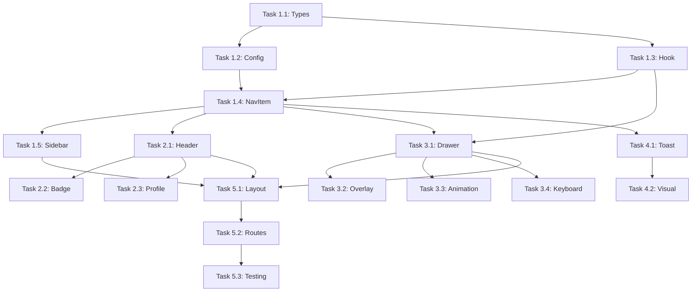

# Implementation Tasks: Navigation Shell

**Feature**: 005-navigation-shell
**Generated**: 2026-01-14
**Spec**: [spec.md](./spec.md) | **Plan**: [plan.md](./plan.md)

## Task Overview

| Phase | User Story | Tasks | Priority |
|-------|------------|-------|----------|
| Phase 1 | US1: Desktop Navigation | 5 tasks | P1 |
| Phase 2 | US2: Top Header | 3 tasks | P1 |
| Phase 3 | US3: Mobile Drawer | 4 tasks | P2 |
| Phase 4 | US4: Placeholder Items | 2 tasks | P3 |
| Phase 5 | Integration & Testing | 3 tasks | P1 |

---

## Phase 1: Desktop Navigation [US1]

### Task 1.1: Create Navigation Types [P1] [US1]
**File**: `src/types/navigation.ts`

- [x] Create `NavigationItem` interface with id, label, icon, path, isPlaceholder, placeholderPhase fields
- [x] Create `NavigationGroup` interface with id and items array
- [x] Create `NavigationState` interface with isDrawerOpen and drawer control methods
- [x] Export all types for use in navigation components

**Acceptance**: Types compile without errors, can be imported in other files

---

### Task 1.2: Create Navigation Configuration [P1] [US1]
**File**: `src/lib/navigation.ts`

- [x] Define `mainNavItems` array with 8 items: Home, Guests, Vendors, Events, Items, Budget, Tasks, Docs
- [x] Set correct Lucide icon names for each item (Home, Users, Handshake, Calendar, Armchair, DollarSign, CheckSquare, FileText)
- [x] Set `isPlaceholder: true` for all items except Home and Events
- [x] Set correct `placeholderPhase` for each placeholder item (Guests=6, Vendors=8, Items=7, Budget=9, Tasks=12, Docs=14)
- [x] Define `bottomNavItems` array with Settings (Phase 15) and Logout (Phase 14)
- [x] Export configuration arrays

**Acceptance**: Configuration matches spec exactly, all items have correct metadata

---

### Task 1.3: Create Navigation State Hook [P1] [US1]
**File**: `src/hooks/useNavigation.ts`

- [x] Create Zustand store with `isDrawerOpen` boolean state
- [x] Implement `openDrawer()` action
- [x] Implement `closeDrawer()` action
- [x] Implement `toggleDrawer()` action
- [x] Export `useNavigation` hook

**Acceptance**: Hook works correctly, drawer state persists across re-renders

---

### Task 1.4: Create NavItem Component [P1] [US1]
**File**: `src/components/layout/NavItem.tsx`

- [x] Accept props: item (NavigationItem), weddingId, isActive, onClick
- [x] Render Lucide icon dynamically based on item.icon name
- [x] Apply default styling: 48px height, 12px/24px padding, 6px border-radius
- [x] Apply hover styling: #EBEBEB background on hover
- [x] Apply active styling: #D4A5A5 background, white text when isActive=true
- [x] Handle click: navigate if not placeholder, show toast if placeholder
- [x] Support keyboard navigation (focusable, enter to activate)

**Acceptance**: All visual states match spec, keyboard accessible

---

### Task 1.5: Create AppSidebar Component [P1] [US1]
**File**: `src/components/layout/AppSidebar.tsx`

- [x] Accept weddingId prop from parent layout
- [x] Render fixed position sidebar with 240px width
- [x] Apply #F5F5F5 background color
- [x] Map mainNavItems to NavItem components in main section
- [x] Map bottomNavItems to NavItem components at bottom with separator
- [x] Use `useLocation` to determine active item based on current path
- [x] Hide on mobile viewports with `hidden lg:block` Tailwind classes

**Acceptance**: Sidebar displays correctly, active state highlights current page

---

## Phase 2: Top Header [US2]

### Task 2.1: Create AppHeader Component [P1] [US2]
**File**: `src/components/layout/AppHeader.tsx`

- [x] Accept weddingId prop from parent layout
- [x] Render fixed position header with 64px height
- [x] Apply white background and shadow (0 2px 8px rgba(0,0,0,0.08))
- [x] Display "Wedding Planner" brand text on the left
- [x] Display notification bell icon with "3" badge on the right
- [x] Display "Profile" dropdown trigger on the right
- [x] Make bell and profile clickable with toast "Coming in Phase 14"
- [x] Show hamburger button on mobile (`lg:hidden`) that triggers drawer open

**Acceptance**: Header displays correctly on all viewports, icons clickable with feedback

---

### Task 2.2: Create Notification Badge Component [P1] [US2]
**File**: `src/components/layout/NotificationBadge.tsx`

- [x] Accept count prop (default: 3)
- [x] Render Bell icon from Lucide
- [x] Render badge with count if count > 0
- [x] Style badge with dusty rose background and white text
- [x] Handle click to show placeholder toast

**Acceptance**: Badge displays correctly, count visible, click shows toast

---

### Task 2.3: Create Profile Dropdown Component [P1] [US2]
**File**: `src/components/layout/ProfileDropdown.tsx`

- [x] Render "Profile" text with User icon
- [x] Handle click to show placeholder toast "Coming in Phase 14"
- [x] Style consistently with header design

**Acceptance**: Profile trigger displays, click shows toast

---

## Phase 3: Mobile Drawer [US3]

### Task 3.1: Create MobileDrawer Component [P2] [US3]
**File**: `src/components/layout/MobileDrawer.tsx`

- [x] Accept weddingId prop from parent layout
- [x] Use `useNavigation` hook for open/close state
- [x] Render 280px wide drawer panel that slides from left
- [x] Apply white background to drawer panel
- [x] Render close button (X icon) at top of drawer
- [x] Map mainNavItems to NavItem components
- [x] Map bottomNavItems to NavItem components with separator
- [x] Close drawer automatically after navigation

**Acceptance**: Drawer opens/closes correctly, all menu items accessible

---

### Task 3.2: Create Drawer Overlay Component [P2] [US3]
**File**: `src/components/layout/DrawerOverlay.tsx`

- [x] Accept isOpen and onClose props
- [x] Render semi-transparent overlay with rgba(0,0,0,0.5)
- [x] Cover full viewport when drawer is open
- [x] Handle click to close drawer
- [x] Apply smooth opacity transition

**Acceptance**: Overlay visible when drawer open, clicking closes drawer

---

### Task 3.3: Implement Drawer Animation [P2] [US3]
**File**: `src/components/layout/MobileDrawer.tsx`

- [x] Apply `transform: translateX(-100%)` when closed
- [x] Apply `transform: translateX(0)` when open
- [x] Use `transition: transform 200ms ease-out` for smooth animation
- [x] Ensure animation completes in under 300ms per spec

**Acceptance**: Drawer animates smoothly, feels responsive

---

### Task 3.4: Implement Keyboard Controls [P2] [US3]
**File**: `src/components/layout/MobileDrawer.tsx`

- [x] Close drawer on Escape key press
- [x] Trap focus within drawer when open
- [x] Return focus to hamburger button when drawer closes
- [x] Ensure all menu items are tab-navigable

**Acceptance**: Full keyboard accessibility, Escape closes drawer

---

## Phase 4: Placeholder Items [US4]

### Task 4.1: Implement Placeholder Toast Messages [P3] [US4]
**File**: `src/components/layout/NavItem.tsx`

- [x] Check if item.isPlaceholder is true on click
- [x] Show toast with message "Coming in Phase {item.placeholderPhase}"
- [x] Use sonner toast component (already installed)
- [x] Prevent navigation for placeholder items

**Acceptance**: All placeholder items show correct phase in toast

---

### Task 4.2: Add Placeholder Visual Indicator [P3] [US4]
**File**: `src/components/layout/NavItem.tsx`

- [x] Optionally add subtle visual indicator for placeholder items (e.g., slightly muted text)
- [x] Keep same hover behavior as active items
- [x] Ensure placeholder items don't show as "active" state

**Acceptance**: Users can distinguish placeholder items if desired, visual consistency maintained

---

## Phase 5: Integration & Testing [US1-4]

### Task 5.1: Create AppLayout Component [P1] [US1-4]
**File**: `src/components/layout/AppLayout.tsx`

- [x] Import AppHeader, AppSidebar, MobileDrawer components
- [x] Use React Router `Outlet` for nested page content
- [x] Get weddingId from `useParams` hook
- [x] Apply layout structure: header at top, sidebar on left, main content with proper margins
- [x] Set main content padding to 32px and max-width to 1400px
- [x] Apply pt-16 (64px) to main for header clearance
- [x] Apply lg:ml-60 (240px) to main for sidebar clearance on desktop

**Acceptance**: Layout renders correctly with all components, content properly positioned

---

### Task 5.2: Update App.tsx Routes [P1] [US1-4]
**File**: `src/App.tsx`

- [x] Import AppLayout component
- [x] Wrap wedding routes (`/weddings/:weddingId/*`) with AppLayout using Route element prop
- [x] Keep wedding list route (`/`) outside of AppLayout
- [x] Ensure all existing routes continue to work (Dashboard, Events, Create Event, Edit Event)

**Acceptance**: Navigation shell appears on wedding pages, not on wedding list page

---

### Task 5.3: Manual Testing Checklist [P1] [US1-4]
**File**: Manual verification

- [x] Desktop: Verify sidebar visible at ≥1024px viewport
- [x] Desktop: Verify active nav item highlighted with dusty rose background
- [x] Desktop: Click Events → navigates to timeline page
- [x] Desktop: Click Home → navigates to dashboard page
- [x] Desktop: Header remains fixed when scrolling
- [x] Mobile: Verify hamburger visible at <768px viewport
- [x] Mobile: Tap hamburger → drawer opens from left
- [x] Mobile: Verify overlay visible behind drawer
- [x] Mobile: Tap overlay → drawer closes
- [x] Mobile: Tap X button → drawer closes
- [x] Mobile: Tap Events → navigates and drawer closes
- [x] Placeholder: Click Guests → shows "Coming in Phase 6" toast
- [x] Placeholder: Click Vendors → shows "Coming in Phase 8" toast
- [x] Placeholder: Click notification bell → shows "Coming in Phase 14" toast
- [x] Keyboard: Tab through nav items works
- [x] Keyboard: Escape closes mobile drawer
- [x] Responsive: Resize browser from desktop to mobile → layout switches correctly

**Acceptance**: All checklist items pass

---

## Dependencies

## Execution Order

1. **Phase 1** (Foundation): Tasks 1.1 → 1.2 → 1.3 → 1.4 → 1.5
2. **Phase 2** (Header): Tasks 2.1 → 2.2 & 2.3 (parallel)
3. **Phase 3** (Mobile): Tasks 3.1 → 3.2 → 3.3 → 3.4
4. **Phase 4** (Polish): Tasks 4.1 → 4.2
5. **Phase 5** (Integration): Tasks 5.1 → 5.2 → 5.3

## Estimated Complexity

| Phase | Complexity | Notes |
|-------|------------|-------|
| Phase 1 | Medium | Core navigation logic and state management |
| Phase 2 | Low | Simple header with static elements |
| Phase 3 | Medium | Animation and accessibility considerations |
| Phase 4 | Low | Toast integration already exists |
| Phase 5 | Low | Route configuration and testing |

**Total Tasks**: 17
**Critical Path**: Types → Config → NavItem → Sidebar/Header/Drawer → Layout → Routes → Testing
